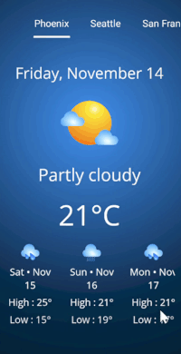

# Creating-Dynamic-Tabs-in-.NET-MAUI-Tab-View-Using-Remote-Data

This sample demonstrates how to create dynamic tabs using a remote data source with the .NET MAUI Tab View control in a .NET MAUI application.

## Sample

```xaml
     <!-- City tabs -->
<tabview:SfTabView x:Name="LocationTabView" ItemsSource="{Binding Cities}" IndicatorBackground="White">

    <!-- Header: city title -->
    <tabview:SfTabView.HeaderItemTemplate>
        <DataTemplate>
            <Label Text="{Binding Name}" TextColor="White" VerticalTextAlignment="Center"
                   FontSize="{OnPlatform Default=18, MacCatalyst=32}"
                   Padding="{OnPlatform WinUI=55, Android=10, iOS=10, MacCatalyst=140}"/>
        </DataTemplate>
    </tabview:SfTabView.HeaderItemTemplate>

    <!-- Content: weather UI -->
    <tabview:SfTabView.ContentItemTemplate>
        <DataTemplate>
            <ScrollView>
                <VerticalStackLayout Padding="{OnPlatform Default=20,MacCatalyst=40}" 
                                     Spacing="{OnPlatform Default=15,MacCatalyst=30}">

                    <!-- current date -->
                    <Label Text="{Binding DateText}" FontSize="{OnPlatform Default=25,MacCatalyst=50}"
                           TextColor="White" HorizontalOptions="Center" />

                    <!-- current weather icon -->
                    <Image Source="{Binding Icon}" HorizontalOptions="Center"
                           HeightRequest="{OnPlatform Default=100,MacCatalyst=200}"/>

                    <!-- current weather condition -->
                    <Label Text="{Binding ConditionText}" HorizontalOptions="Center"
                           FontSize="{OnPlatform Default=28,MacCatalyst=56}" TextColor="White"/>

                    <!-- current temperature -->
                    <Label Text="{Binding TempText}" FontSize="{OnPlatform Default=46,MacCatalyst=92}"
                           TextColor="White" HorizontalOptions="Center" />

                    <!-- Daily Forecast -->
                    <ScrollView Orientation="Horizontal" HeightRequest="200">
                        <CollectionView ItemsSource="{Binding NextDays}" ItemsLayout="HorizontalList"
                                        HorizontalOptions="Center" SelectionMode="None">
                            <CollectionView.ItemTemplate>
                                <DataTemplate>
                                    <VerticalStackLayout Spacing="6" HorizontalOptions="Center"
                                                         WidthRequest="{OnPlatform Default=126,MacCatalyst=252}">
                                        <Image Source="{Binding Icon}" HorizontalOptions="Center"
                                               HeightRequest="{OnPlatform Default=30,MacCatalyst=60}"/>
                                        <Label Text="{Binding DayText}" TextColor="White" HorizontalOptions="Center"
                                               FontSize="{OnPlatform Default=18,MacCatalyst=32}" HorizontalTextAlignment="Center" />
                                        <Label Text="{Binding HighText}" TextColor="White" HorizontalOptions="Center"
                                               FontSize="{OnPlatform Default=18,MacCatalyst=32}"/>
                                        <Label Text="{Binding LowText}" TextColor="White" HorizontalOptions="Center"
                                               FontSize="{OnPlatform Default=18,MacCatalyst=32}"/>
                                    </VerticalStackLayout>
                                </DataTemplate>
                            </CollectionView.ItemTemplate>
                        </CollectionView>
                    </ScrollView>
                </VerticalStackLayout>
            </ScrollView>
        </DataTemplate>
    </tabview:SfTabView.ContentItemTemplate>
</tabview:SfTabView>
```

### Output



## Requirements to run the demo

To run the demo, refer to [System Requirements for .NET MAUI](https://help.syncfusion.com/maui/system-requirements)

## Troubleshooting:

### Path too long exception

If you are facing path too long exception when building this example project, close Visual Studio and rename the repository to short and build the project.

## License

Syncfusion has no liability for any damage or consequence that may arise from using or viewing the samples. The samples are for demonstrative purposes. If you choose to use or access the samples, you agree to not hold Syncfusion liable, in any form, for any damage related to use, for accessing, or viewing the samples. By accessing, viewing, or seeing the samples, you acknowledge and agree Syncfusion's samples will not allow you seek injunctive relief in any form for any claim related to the sample. If you do not agree to this, do not view, access, utilize, or otherwise do anything with Syncfusion's samples.